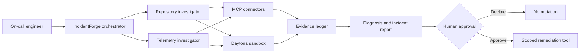

# IncidentForge architecture

## Design goal

IncidentForge separates evidence collection, hypothesis testing, and consequential action. The agent may inspect and analyze automatically, but it must never turn a recommendation into a production mutation without explicit human approval.

## Core boundaries

- **Orchestrator:** owns the investigation plan, delegates bounded tasks, reconciles conflicting findings, and communicates uncertainty.
- **Investigators:** gather evidence for one hypothesis or source domain. They do not perform remediation.
- **Sandbox:** executes generated analysis code against copied or synthetic inputs, never against uncontrolled production state.
- **Evidence ledger:** records source, retrieval time, observation, and whether a conclusion is direct evidence or inference.
- **Approval gate:** is mandatory before external writes, configuration changes, deployments, restarts, rollbacks, or other consequential actions.

## Initial connector strategy

The MVP begins with GitHub and one pluggable observability source. Connector-specific data is normalized into a small evidence record so another provider can be added without rewriting the investigation workflow.

## Trust model

Inputs from tickets, logs, repositories, and MCP tools are untrusted data. They may contain prompt injection, secrets, stale information, or misleading instructions. IncidentForge treats retrieved instructions as evidence to inspect, not commands to execute.

