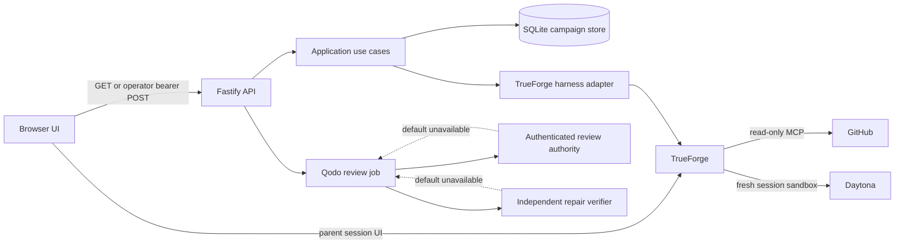

# OpenQuest architecture

## System boundary

OpenQuest is a local, single-operator web application around TrueForge. The React interface owns onboarding, discovery, durable campaign presentation, and approval issuance. Fastify owns validation, authorization, orchestration, and sanitized public projections. SQLite is the campaign system of record. TrueForge owns agent sessions; the registered OpenQuest agent is configured to use GitHub read-only MCP tools, dynamic subagents, and a Daytona sandbox.

The dashed default-provider edges are intentional fail-closed seams. The current container injects `UnavailableQodoReviewAuthority` and reports the repair verifier unavailable, so the service is live but not ready for the full Qodo loop.

## Clean architecture

- `src/domain` contains dependency-free campaign transitions, exact approval actions, discovery classification, evidence, and the maximum-three-iteration Qodo quality rule.
- `src/application` coordinates campaign creation and execution, durable approval proposals, external-action claims, Qodo synchronization, and repair verification through ports.
- `src/adapters` implements local SQLite persistence, TrueForge session execution, strict GitHub discovery envelopes, and Qodo review parsing.
- `src/server` validates HTTP inputs, applies capability authorization, exposes sanitized projections, composes production adapters, and runs the bounded review scheduler.
- `src/web` validates every API response before display and embeds the campaign's parent TrueForge session alongside durable evidence and approvals.

Network, model, sandbox, review, persistence, clock, and identifier behavior enter the core through explicit interfaces. The domain does not import the SDK, Fastify, React, or SQLite.

## Campaign and memory model

One public GitHub issue maps to one campaign. Creation checks for an existing repository/issue campaign, creates one parent TrueForge session, and then persists the campaign. If persistence fails, OpenQuest attempts to delete the unused session and reports when cleanup needs reconciliation; this is not a distributed transaction. The SQLite record stores campaign identity and version, ordered events, direct/inference evidence, approvals, external references, external-action claims, operation results, Qodo findings, and escalation evidence.

The browser does not hold authoritative campaign memory. It reloads a sanitized projection from SQLite. The embedded TrueForge panel resumes the parent session, while every discovery or campaign operation uses a fresh child session. Child packets contain the single campaign's identity, verified direct evidence, approval digests and statuses, current commit when known, a bounded goal, and operation-specific context. They do not inherit another campaign's SQLite record or approval authority.

This is local durable memory, not a multi-user or distributed persistence system. Browser operator capability is memory-only React state and disappears on reload, close, or disconnect.

## Live discovery and read-only chat

Repository discovery sends a strict `discover` packet to a fresh OpenQuest TrueForge session. The catalog accepts only validated JSON for public GitHub repositories, contribution signals, source-linked evidence, and issues whose canonical URLs match the requested repository. Repository content remains untrusted.

The agent manifest enables GitHub `@read-only` tools only. It declares approval requirements for write and destructive categories, but those categories are not enabled in the current chat configuration. The embedded parent-session chat is therefore a research and campaign-context surface, not a publication path.

There is no runtime fixture adapter. Files under `fixtures/` are consumed by tests only, and production has no silent fallback when GitHub, TrueForge, Daytona, or Qodo is unavailable.

## Sandbox lifecycle and static preflight

`TrueForgeHarness.runChildSession` creates a new named TrueForge session before every `discover`, `preflight`, `implement`, `verify`, `sync_qodo`, or `repair` operation. TrueForge associates the session with the OpenQuest agent, whose sandbox configuration is enabled and whose registered provider must be Daytona. OpenQuest records returned child-session IDs, sandbox/session references, bounded artifact paths under `artifacts/`, summaries, and validated outputs.

OpenQuest relies on TrueForge and Daytona to provision and contain each session sandbox. The application does not directly call a Daytona SDK, request or confirm child-sandbox teardown, verify deletion receipts, or implement host-level containment. If the provider is unavailable, the harness fails rather than falling back to host execution.

Before installation or repository-script execution, the `preflight` child must return:

1. `manifest_and_lifecycle_scripts`
2. `suspicious_paths`
3. `credential_and_secret_boundary`
4. `network_behavior`
5. `repository_metadata`

The response must contain all five checks without omissions or duplicates, a lowercase 40-character commit SHA, source-linked evidence for each check, and literal `dependenciesInstalled: false` and `repositoryScriptsExecuted: false`. A `pass` moves to `baseline`; `quarantine` or malformed/failed output moves to `quarantined`. Preflight is a risk-reduction gate, not proof that arbitrary repository code is safe.

Implementation requires a successful preflight commit. Verification requires a recorded implementation result for the current campaign version and commit. Failures move to quarantine or human escalation and remain visible as durable events.

## Exact approvals and external writes

The server accepts only five external-action payload shapes: issue comment, assignment request, branch push, pull-request creation, and pull-request update. A server-owned durable proposal binds the entire validated payload, SHA-256 digest, campaign version, campaign status, current commit where applicable, and accessible change brief.

The UI displays every exact field and requires the operator to confirm review. `POST /api/campaigns/:id/approvals` requires the operator capability, an idempotency key, proposal ID, exact digest, and expected campaign version. The store issues one active approval, expires it after ten minutes, and invalidates mismatched, replayed, stale, or already-consumed authority. External execution first atomically consumes the approval and records a claim. An unknown callback outcome is fenced for explicit reconciliation rather than retried blindly.

The server-only publisher boundary exposes only `push_branch` and `create_pr` through `POST /api/campaigns/:id/publish`. Each request carries the complete exact-approved payload and approval ID; `RunCampaign.executeApprovedExternalAction` performs the existing digest, version, status, replay, claim, and unknown-outcome fencing before calling the injected publisher port. Push and PR creation therefore require separate scoped approvals. The TrueForge agent remains read-only. PR bodies must include the canonical issue link, verified tests, risks, rollback, and AI disclosure, and the route accepts exactly one canonical commit or pull-request URL as evidence. Successful PR creation atomically records that URL and advances the campaign to `pull_request_open`. An ambiguous write returns the fixed `publication_outcome_unknown` problem and remains fenced until an operator uses the strictly validated reconciliation route with independently observed canonical evidence.

## Qodo quality gate

For a campaign with exactly one pull-request URL and current commit, the scheduled review path asks TrueForge only for a canonical Qodo review locator. An independently injected authority must resolve authenticated review identity, receipt, commit, completion, tests, and comments. Normalization rejects non-allowlisted authors, malformed or cross-PR data, conflicting duplicates, and unsafe paths.

The quality gate passes only when tests passed, no open high/medium finding remains, and every remaining non-fixed finding has a disposition. Otherwise it starts a fresh `repair` child session. A repair is durable only when an independent verifier binds the campaign, repository, pull request, child and sandbox sessions, parent and candidate commits, test policy, and canonical receipt. Publication still requires a new exact `update_pr` approval.

The durable iteration counter may advance from zero through three. At iteration three, unresolved findings or failed tests escalate to a human; the scheduler does not start iteration four. Provider timeouts or unavailable/incomplete review evidence leave the gate pending or degraded rather than passing.

The default container cannot complete this path because both authenticated review authority and independent repair verification are unconfigured. See `docs/qodo-workflow.md` for the adapter contract.

## HTTP and readiness contracts

All request query strings are rejected unless empty, and request bodies are strictly validated. `GET` and `HEAD` routes are read-only and do not require bearer authorization. Other routes require the operator capability except review synchronization, which requires a distinct review-provider capability. Public campaign responses omit raw Qodo bodies, source paths and lines, approval payload authority, and arbitrary event fields.

Key routes are:

- `GET /api/healthz`: returns HTTP 200 with `ok` or sanitized degraded review state.
- `GET /api/readyz`: returns HTTP 200 only when required review health is ready; otherwise HTTP 503.
- `GET /api/spaces`: curated onboarding spaces.
- `POST /api/discovery/repositories`: authenticated live repository discovery.
- `GET /api/discovery/repositories/:owner/:repo/issues`: live, read-only issue discovery.
- `POST /api/campaigns`: authenticated campaign creation.
- `GET /api/campaigns/:id`: sanitized durable campaign projection.
- `POST /api/campaigns/:id/actions/:action`: authenticated `preflight`, `implement`, or `verify` execution.
- `POST /api/campaigns/:id/approvals`: authenticated exact-approval issuance only.
- `POST /api/campaigns/:id/publish`: authenticated server-only execution of an exact-approved branch push or pull-request creation.
- `POST /api/campaigns/:id/publication/reconcile`: authenticated operator reconciliation of an unknown publication outcome.
- `POST /api/campaigns/:id/reviews/sync`: separately authenticated Qodo locator ingestion.

The web UI exposes onboarding, discovery, campaign creation, campaign reading, and approval issuance. It does not currently expose controls for the three campaign action routes or review synchronization.

## Failure and concurrency behavior

Campaign versions provide optimistic concurrency. SQLite uniqueness and transactions prevent two campaigns for one issue, duplicate active approval digests, duplicate external claims, and conflicting Qodo review persistence. Idempotency keys make exact approval retries stable. Unknown external outcomes require reconciliation, and stale active claims require an explicit operator disposition.

The Qodo scheduler runs one tick at a time. Request and scheduler work use abort signals, timeouts, and revocable persistence leases so a late provider result cannot write after shutdown or request cancellation. Liveness remains observable while readiness fails closed for missing provider authority, missing repair verification, stale store health, stopped scheduling, or retry failures.
